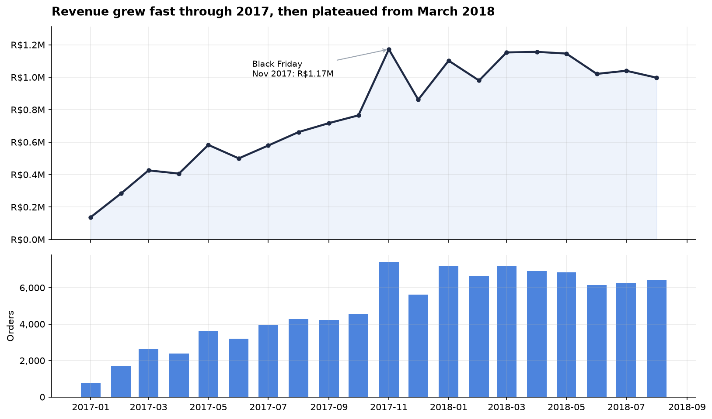
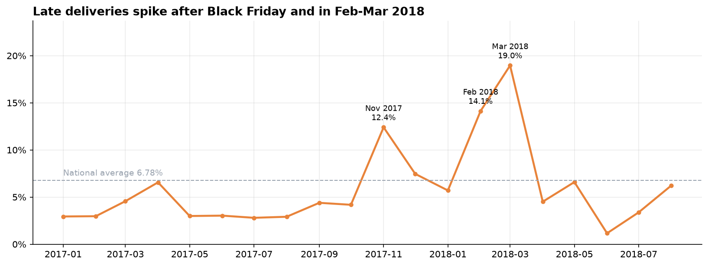
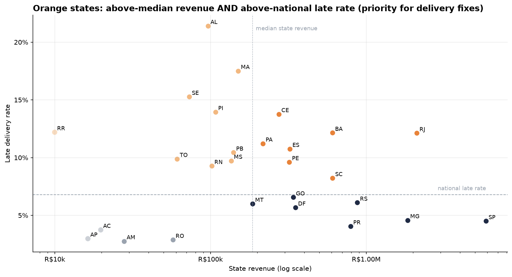
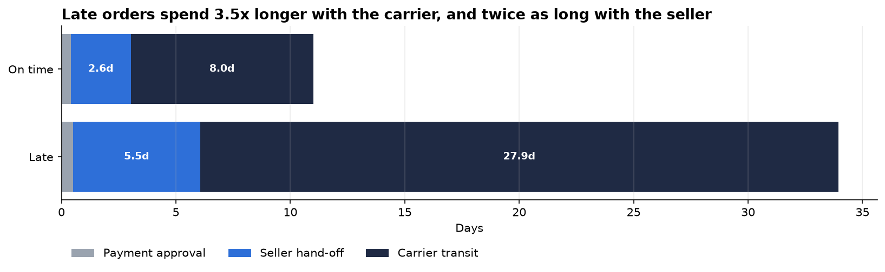
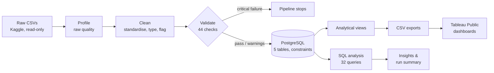

# Sales & Operations Analytics Dashboard

**An end-to-end analytics pipeline that turns 100k raw e-commerce orders into validated KPIs, business insights and interactive dashboards. Automated with Airflow.**


> **Interactive dashboard:** [Olist Sales & Operations Dashboard](https://public.tableau.com/app/profile/dirgha.jivani/viz/OlistSalesOperationsDashboard/SalesOverview)

---

## The business problem

Olist is a Brazilian marketplace that sells products from thousands of small merchants and manages
their payments and delivery. Its sales and operations teams had ~100k orders of raw data, but
**no single, trustworthy answer** to the questions that drive their decisions:

| Team | Question this project answers |
|---|---|
| Sales leadership | Is revenue growing, and is that growth coming from more customers or bigger baskets? |
| Sales leadership | Which months, product categories and states actually drive revenue? |
| Operations | How fast do we deliver, and how often do we break the delivery promise? |
| Operations | *When* and *where* do late deliveries happen, and which stage (seller or carrier) causes them? |
| Regional managers | Which states combine high revenue with poor delivery, so fixing them matters most? |
| Everyone | Can these numbers be trusted? |

This project builds the full pipeline to answer them: raw CSV → profiling → cleaning → validation →
PostgreSQL → SQL analysis → dashboards. It runs automatically every day.

---

## Key findings

| Finding | Why it matters |
|---|---|
| **Revenue +140% year over year** (Jan–Aug 2018 vs 2017), but average order value grew only **1.3%** | Growth comes entirely from acquiring new customers, not from bigger baskets |
| **Revenue has plateaued since March 2018** and is down **13.8%** from the April peak | The growth engine is slowing and needs a new lever |
| **6.78% of deliveries are late** nationally, rising to **19%** for March 2018 orders and **21%** in Alagoas | Delivery reliability breaks down at peak times and in the Northeast |
| Late orders spend **27.9 days with the carrier vs 8.0** for on-time orders | Most delay comes from the carrier, not the seller or payment |
| **7 states hold 28% of revenue but 43% of late orders** (RJ, SC, BA, ES, PE, CE, PA) | A focused list of states where delivery fixes pay off most |
| Only **3.1%** of customers ever ordered twice | Retention is the biggest untapped growth opportunity |

The full analysis, recommendations and caveats are in [**Business Insights**](docs/business_insights.md).

<table>
<tr>
<td></td>
<td></td>
</tr>
<tr>
<td></td>
<td></td>
</tr>
</table>

---

## How it works



Every box above is one task in the **Airflow DAG**. The same steps can also be run from the command line.

| Stage | What happens | Code |
|---|---|---|
| **Ingest & profile** | Check the files and expected columns, then measure missing values, duplicates, date ranges and invalid values in the *raw* data | `src/ingestion.py`, `src/profiling.py` |
| **Clean** | Standardise names and text, convert types, pad zip codes, translate categories, set impossible values to NULL (never 0), and *flag* rather than delete suspicious records. Raw files are never modified | `src/cleaning.py` |
| **Validate** | 44 rules covering keys, foreign keys, required fields, value ranges and date logic. **PASS / WARNING / FAIL**; any FAIL stops the pipeline before the database is touched | `src/validation.py` |
| **Load** | PostgreSQL schema with primary keys, foreign keys, CHECK constraints and indexes. TRUNCATE + COPY runs in **one transaction**, so a failed load leaves the previous data intact. Row counts are verified after loading | `sql/schema.sql`, `src/database.py` |
| **Analyse** | 32 named SQL queries for sales, operations and regional analysis. Results are exported to CSV | `sql/*_analysis.sql`, `src/transformation.py` |
| **Serve** | Analytical views (one row per order or item) plus a data-quality view, exported for Tableau | `sql/analytical_views.sql`, `sql/data_quality.sql` |
| **Orchestrate** | Daily Airflow DAG with retries. Validation never retries, because a data problem won't fix itself | `airflow/sales_operations_pipeline.py` |

### Engineering decisions worth noting

- **Trustworthy numbers:** automated tests check that the dashboard views reconcile exactly with the SQL KPIs, e.g. view revenue = KPI revenue to the cent.
- **Nothing silently disappears:** cleaning removed **0 rows**. Problem records are flagged, for example 189 orders with impossible date sequences. They stay in revenue but are excluded from delivery-time metrics, and every decision is logged in the [data quality report](docs/data_quality_report.md).
- **NULL is not zero:** a missing delivery date means "not delivered", not "0 days".
- **Clear metric definitions:** revenue, "late", "customer" and "measurable delivery" are each defined once and used everywhere. See [Business Requirements](docs/business_requirements.md).
- **Secure by default:** credentials come only from environment variables (`.env`, git-ignored), and nothing is hard-coded.
- **Reproducible:** package versions are pinned to Airflow's constraints, so the laptop and the Airflow containers run identical code.

---

## Dashboards (Tableau Public)

**Live workbook:** [Olist Sales & Operations Dashboard](https://public.tableau.com/app/profile/dirgha.jivani/viz/OlistSalesOperationsDashboard/SalesOverview)

| Dashboard | Audience | Shows |
|---|---|---|
| **Sales Performance Overview** | Sales leadership | Revenue, orders, AOV and customer KPIs with year-over-year change; monthly trend; top categories; revenue by state |
| **Operations Performance** | Operations / logistics | Delivery time vs promise, late rate trend, late deliveries by state and category, fulfilment stage times |
| **Regional & Data Quality** | Regional managers, BI | State scorecard and revenue-vs-delivery segments; pipeline data-quality checks |

The build specification is in [`tableau/dashboard_requirements.md`](tableau/dashboard_requirements.md), and the field definitions are in [`tableau/tableau_data_dictionary.md`](tableau/tableau_data_dictionary.md).

---

## Tech stack

| Area | Tools |
|---|---|
| Language & data processing | Python 3.11, pandas, NumPy |
| Database | PostgreSQL 17, SQLAlchemy, psycopg2 (bulk COPY) |
| Analysis | SQL (CTEs, window functions, FILTER aggregates, percentiles, views) |
| Orchestration | Apache Airflow 2.10 on Docker Compose |
| Visualisation | Tableau Public, matplotlib (notebook) |
| Quality | pytest (67 tests), 44 validation rules, 36 in-database quality checks |

---

## Dataset

[Brazilian E-Commerce Public Dataset by Olist](https://www.kaggle.com/datasets/olistbr/brazilian-ecommerce) (Kaggle):
real, anonymised marketplace orders from **September 2016 to October 2018**.

| Table | Rows | Description |
|---|---|---|
| orders | 99,441 | Order status and lifecycle timestamps (purchase → approval → carrier → delivery) |
| order_items | 112,650 | Items, price and freight |
| payments | 103,886 | Payment type, installments and value |
| customers | 99,441 | Customer location (city, state, zip prefix) |
| products | 32,951 | Category and physical attributes |

All columns are described in the [Data Dictionary](docs/data_dictionary.md).

---

## Run it yourself

**Prerequisites:** macOS or Linux, Python 3.11, PostgreSQL 17, a free Kaggle account, and optionally Docker Desktop for Airflow.

```bash
# 1. Environment
python3.11 -m venv .venv && source .venv/bin/activate
pip install -r requirements.txt

# 2. Configuration: fill in passwords (never commit .env)
cp .env.example .env

# 3. Data: needs a Kaggle API token in ~/.kaggle/
scripts/download_data.sh

# 4. Database: creates the project role and database (asks for the postgres superuser password)
scripts/setup_database.sh

# 5. Run the full pipeline (~40 seconds)
python -m src.pipeline
```

The run writes:
- `data/processed/clean/`: the cleaned tables
- `data/processed/analysis/`: one CSV per SQL query
- `data/processed/tableau/`: the dashboard data
- `data/processed/pipeline_summary.json`: headline KPIs and row counts
- [`docs/data_quality_report.md`](docs/data_quality_report.md): the data quality report

**Individual steps:** `python -m src.pipeline clean_data validate_data`. The step names are listed in `src/pipeline.py`.

### Airflow

```bash
docker compose up -d                   # webserver, scheduler and metadata database
open http://localhost:8080             # log in with AIRFLOW_ADMIN_USER / AIRFLOW_ADMIN_PASSWORD from .env
```

Enable the **`sales_operations_pipeline`** DAG, then trigger it with ▶. It also runs daily.

```
check_raw_data → profile_data → clean_data → validate_data → load_postgresql → create_views
    → [run_sales_analysis | run_operations_analysis | run_regional_analysis] → export_tableau_data → generate_summary
```

Stop it with `docker compose down`.

### Tests

```bash
pytest                      # all 67 tests
pytest -m "not database"    # only the tests that don't need PostgreSQL
```

The tests run the cleaning and validation code on deliberately messy sample data: duplicates, bad dates,
negative prices, impossible weights and broken table links. They also check that the SQL never uses `SELECT *`,
and that the dashboard views reconcile with the analysis.

---

## Project structure

```
├── airflow/sales_operations_pipeline.py   Airflow DAG (one task per pipeline step)
├── src/
│   ├── pipeline.py        runs the steps in order (used by Airflow and the CLI)
│   ├── ingestion.py       raw file checks and loading
│   ├── profiling.py       raw data profile        → data quality report §1
│   ├── cleaning.py        cleaning rules          → data quality report §2
│   ├── validation.py      44 validation checks    → data quality report §3
│   ├── database.py        schema, transactional bulk load, row-count checks
│   ├── transformation.py  runs SQL analyses, builds views, exports for Tableau
│   ├── reporting.py       markdown report helpers
│   └── config.py          paths, env-based settings, logging
├── sql/
│   ├── schema.sql                tables, keys, constraints, indexes
│   ├── sales_analysis.sql        15 sales queries
│   ├── operations_analysis.sql   13 delivery & fulfilment queries
│   ├── regional_analysis.sql      4 state / region queries
│   ├── analytical_views.sql      dashboard views
│   └── data_quality.sql          in-database quality checks
├── tests/                 pytest suite with messy sample fixtures
├── notebooks/exploratory_analysis.ipynb
├── tableau/               dashboard specification and Tableau data dictionary
├── docs/
│   ├── business_requirements.md   questions, KPIs, scope
│   ├── business_insights.md       findings & recommendations
│   ├── data_dictionary.md         database tables and views
│   ├── data_quality_report.md     generated by the pipeline
│   └── architecture.md            design decisions and data model
├── scripts/               data download and database setup
├── docker-compose.yml     Airflow stack
└── requirements.txt       pinned dependencies
```

---

## Limitations

- The data ends in October 2018. Trends use January 2017 – August 2018, because the months outside that window are too sparse.
- There is no cost or margin data, so **revenue is gross merchandise value, not profit**.
- The analysis shows *where and when* delays happen, but not *why*, because carrier identity isn't in the dataset.
- Seller, review and geolocation tables are out of scope.

---

## Author

**Dirgha Jivani** · AI Product Builder

[GitHub](https://github.com/jdirgha)
