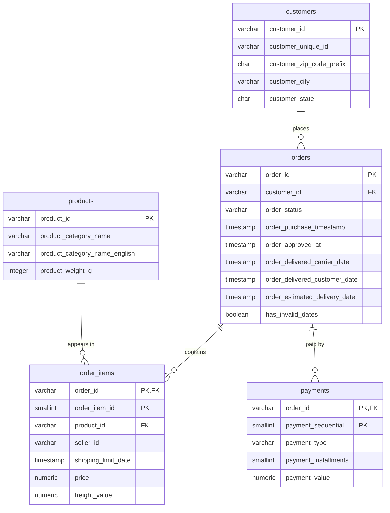

# Architecture

## Pipeline

```
data/raw/*.csv  (read-only, from Kaggle)
      │
      ▼
src/ingestion.py     check files exist and have the expected columns; read as text
      │
      ▼
src/profiling.py     profile the raw state            -> data_quality_report.md §1
      │
      ▼
src/cleaning.py      standardise, type, flag          -> data/processed/clean/*.csv, report §2
      │
      ▼
src/validation.py    PASS / WARNING / FAIL checks     -> report §3; any FAIL stops the pipeline
      │
      ▼
src/database.py      TRUNCATE + COPY into PostgreSQL in one transaction; verify row counts
      │
      ▼
sql/*.sql            analysis queries and analytical views
      │
      ▼
Tableau Public       dashboards built on CSV exports of the analytical views
```

The steps are defined once in `src/pipeline.py`. The Airflow DAG (`airflow/sales_operations_pipeline.py`)
runs each one as a task: the three analysis tasks run in parallel, and validation never retries.
`python -m src.pipeline` runs the same steps without Airflow.

## Environments

| Component | Where it runs |
|---|---|
| Python pipeline | Local `.venv` (Python 3.11) or inside the Airflow containers |
| Analytics database | PostgreSQL 17 on the Mac host, database `olist_analytics`, role `olist_analyst` |
| Airflow | Docker Compose (webserver, scheduler, its own metadata Postgres container) |
| Dashboards | Tableau Public desktop app |

Credentials are read from `.env` (never committed). Package versions are pinned to the
Airflow 2.10.5 constraints so local and container runs behave identically.

## Data model



### Grain of each table

| Table | One row per | Primary key |
|---|---|---|
| customers | customer record created for an order (Olist issues a new `customer_id` per order; `customer_unique_id` identifies the person) | `customer_id` |
| orders | order | `order_id` |
| order_items | item line within an order | `order_id`, `order_item_id` |
| products | product | `product_id` |
| payments | payment installment record of an order | `order_id`, `payment_sequential` |

### Design decisions

- **Normalised source tables, analytical views on top.** Tables keep the grain of the source
  so every metric can be traced back; the views in `sql/analytical_views.sql` pre-join and
  aggregate for Tableau.
- **Constraints mirror the critical validation rules** (primary keys, foreign keys,
  non-negative amounts, delivery on/after purchase). Invalid data is stopped by
  `validation.py` first, and the database rejects it as a second line of defence.
- **NULL means unknown or not applicable**, never zero (see `data_quality_report.md` §2.3).
- **Indexes** cover the most common join and filter columns: `orders.customer_id`,
  `orders.order_purchase_timestamp`, `orders.order_status`, `order_items.product_id`,
  `customers.customer_unique_id`, `customers.customer_state`. Lookups by `order_id`
  use the primary key indexes (`order_id` is the leading column on `order_items` and `payments`).
- **Timestamps are `TIMESTAMP` without time zone**: the source has no zone information,
  and all dates are Brazilian marketplace local time.
- **Full refresh loading.** The dataset is small (~450k rows in total), so each run truncates
  and reloads every table in a single transaction. This is simpler and safer than incremental
  logic, and a failed load leaves the previous data in place.
